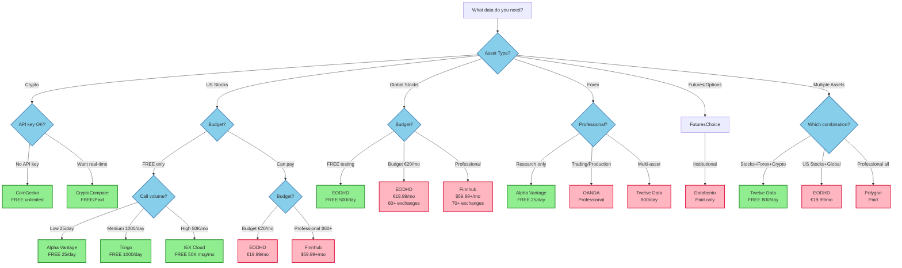

# Provider Selection Guide

Choose the right data provider for your needs with this decision flowchart.

## Quick Decision Flowchart

## Provider Comparison Matrix

### By Asset Class

| Provider | Crypto | US Stocks | Global Stocks | Forex | Futures | API Key | Free Tier | Best For |
|----------|--------|-----------|---------------|-------|---------|---------|-----------|----------|
| **CoinGecko** | ✅ | ❌ | ❌ | ❌ | ❌ | No | Unlimited | Crypto historical |
| **CryptoCompare** | ✅ | ❌ | ❌ | ❌ | ❌ | Optional | Good | Crypto real-time |
| **Tiingo** | ✅ | ✅ | ❌ | ❌ | ❌ | Yes | 1000/day | High-quality stocks |
| **IEX Cloud** | ❌ | ✅ | ❌ | ❌ | ❌ | Yes | 50K/mo | US equities + fundamentals |
| **Alpha Vantage** | ✅ | ✅ | ✅ | ✅ | ❌ | Yes | 25/day | Multi-asset research |
| **EODHD** | ❌ | ✅ | ✅ | ❌ | ❌ | Yes | 500/day | Global stocks, best value |
| **Finnhub** | ✅ | ✅ | ✅ | ✅ | ❌ | Yes | Paid only | Professional grade |
| **Twelve Data** | ✅ | ✅ | ❌ | ✅ | ❌ | Yes | 800/day | Multi-asset + indicators |
| **OANDA** | ❌ | ❌ | ❌ | ✅ | ❌ | Yes | No | Professional forex |
| **Databento** | ❌ | ✅ | ❌ | ❌ | ✅ | Yes | Paid only | Institutional derivatives |
| **Polygon** | ✅ | ✅ | ❌ | ✅ | ❌ | Yes | Paid only | Professional multi-asset |

### By Pricing

#### Free Tier (No Credit Card Required)

| Provider | Daily Limit | Monthly Limit | Best Use Case |
|----------|-------------|---------------|---------------|
| **CoinGecko** | 10-50 calls/min | Unlimited | Crypto research |
| **IEX Cloud** | N/A | 50K messages | US stock research |
| **Tiingo** | 1000 calls | 500 symbols | Daily stock updates |
| **Alpha Vantage** | 25 calls | 750 calls | Conservative research |
| **EODHD** | 500 calls | ~15K calls | Global stock testing |
| **Twelve Data** | 800 calls | ~24K calls | Multi-asset research |
| **CryptoCompare** | Varies | Varies | Crypto real-time |

#### Paid Tiers (Affordable)

| Provider | Price | What You Get |
|----------|-------|--------------|
| **EODHD** | €19.99/mo | 150K+ global tickers, unlimited calls |
| **Twelve Data** | $9.99/mo | 800 calls/min, multi-asset |
| **Tiingo** | $30/mo | 20K calls/hour, news, fundamentals |
| **Alpha Vantage** | $49.99/mo | 75 calls/min, all features |

#### Professional Tiers

| Provider | Starting Price | What You Get |
|----------|----------------|--------------|
| **Finnhub** | $59.99/mo | Historical OHLCV, 70+ exchanges |
| **Polygon** | $99/mo | Multi-asset, professional-grade |
| **Databento** | Custom | Institutional derivatives data |

## Decision Guidelines

### For Beginners
1. **Start with CoinGecko** (crypto) - No API key, unlimited free tier
2. **Try Tiingo** (stocks) - Generous free tier (1000/day), great quality
3. **Experiment freely** - All providers have free tiers or trials

### For Researchers
1. **Tiingo** - High-quality stock data with generous limits
2. **Alpha Vantage** - Multi-asset but limited (25/day)
3. **EODHD** - Global coverage, excellent value (€19.99/mo)

### For Traders
1. **EODHD** - Best value for global stocks (€19.99/mo)
2. **OANDA** - Professional forex data
3. **Finnhub** - Real-time + historical, professional grade

### For Institutions
1. **Databento** - Tick-level derivatives data
2. **Polygon** - Multi-asset professional data
3. **Finnhub** - Global exchange coverage

## Quick Recommendations

### "I want crypto data"
→ **CoinGecko** (no API key, unlimited)

### "I want US stock data for free"
→ **Tiingo** (1000/day) or **IEX Cloud** (50K msg/month)

### "I want global stock data"
→ **EODHD** (€19.99/mo for 60+ exchanges)

### "I want stocks + forex + crypto"
→ **Twelve Data** (800/day free) or **Alpha Vantage** (25/day free)

### "I'm building a trading system"
→ **Finnhub** ($59.99+/mo) or **EODHD** (€19.99/mo)

### "I need professional derivatives data"
→ **Databento** (paid only)

## Rate Limit Considerations

### Conservative (Good for testing)
- **Alpha Vantage**: 25/day
- **EODHD Free**: 500/day
- **Twelve Data Free**: 800/day

### Moderate (Good for research)
- **Tiingo**: 1000/day
- **IEX Cloud**: 50K messages/month
- **CoinGecko**: 10-50/min

### High Volume (Good for production)
- **EODHD Paid**: Unlimited
- **Finnhub**: 60/min (free), higher (paid)
- **Tiingo Paid**: 20K/hour

## Next Steps

1. **Read the full provider docs** in the [main README](../README.md)
2. **Check provider status** in your target asset class
3. **Get API keys** from provider websites
4. **Test with free tiers** before committing to paid plans
5. **Use incremental updates** to minimize API calls

## Getting Help

- **Documentation**: See [docs/user-guide/](user-guide/)
- **Examples**: Check [examples/](../examples/) directory
- **Issues**: Report problems on GitHub
- **Community**: Join discussions for provider recommendations
